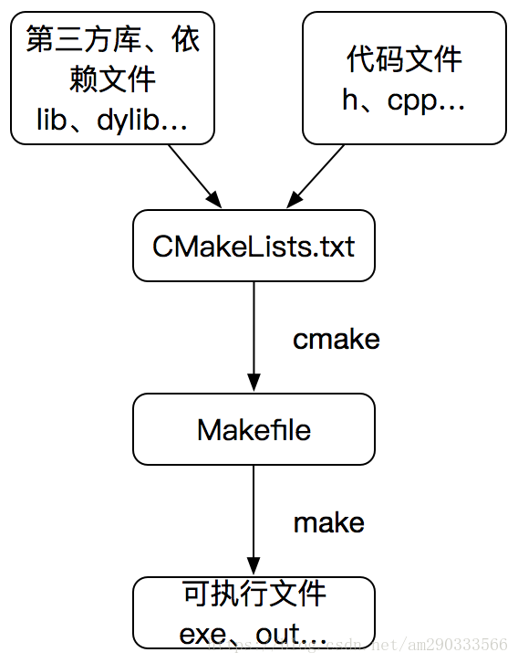

## cmake, make, CMakeList.txt, Makefile之间的关系

> 编写程序的大体流程为：
> 1. 用编辑器（vim、emacs等）编写源代码文件（.h、.cpp等）；
> 2. 用编译器编译代码生成目标文件（.o等）；
> 3. 用链接器连接目标文件生成可执行文件（.exe等）。

* `make`是一个自动化的批量编译工具，可以实现用一个命令构建整个工程的目的。
但是其执行需要依赖一个规则文件，这个文件就是`Makefile`。
`Makefile`文件里详细描述了构建的细节（文件的依赖关系，编译的先后顺序等）。

* 对于一个大工程来说，编写`Makefile`文件也是一项非常复杂的事情。

* `cmake`(Cross-platform Make)是一个可以自动生成`Makefile`文件的工具，
当然它不只能生成`Makefile`，还能跨平台生成主流IDE(VS, xcode…)构建工程所需的project文件。

* `cmake`的执行同样需要依赖规则文件，这个文件就是`CMakeLists.txt`。

综上所述，大致可以总结`cmake`,`make`,`CMakeList.txt`,`Makefile`之间的关系，如下图所示：

### Reference

[	
cmake, make, CMakeLists.txt, Makefile简介](https://blog.csdn.net/am290333566/article/details/81186591)
